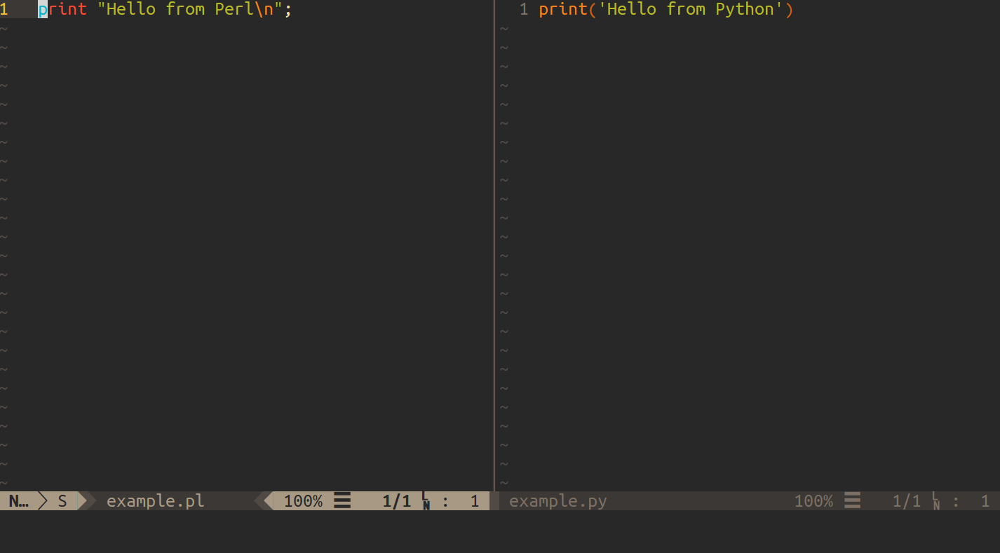

# RunInTerm

RunInTerm is a plug-in for the [Neovim](https://www.neovim.io) and [Vim 8+](https://www.vim.org/) editors, providing a convenient way of intelligently executing buffer contents and terminal commands via Vim's inbuilt terminal emulator.



## Table of contents

  * [Installation](#installation)
  * [Quick Start](#quick-start)
  * [Key Bindings](#key-bindings)
  * [Settings](#settings)

## Installation

Using the [vim-plug](https://github.com/junegunn/vim-plug) plug-in manager, add the following to your `vimrc` file:

```vim
call plug#begin()
  Plug 'HawkinsT/RunInTerm'
call plug#end()
```

Then run `:PlugInstall` from within Vim.

Alternatively, this plug-in may be loaded for only specific file types using (e.g. for perl and python):

```vim
call plug#begin()
  Plug 'HawkinsT/RunInTerm', { 'for': ['perl', 'python'] }
call plug#end()
```

This plug-in may be similarly loaded using other plug-in managers; for this, see their respective documentation.

## Quick Start

This plug-in provides the function `RunInTerminal()`, which may take up to two optional arguments.

If run without arguments, it executes the contents of the current buffer via its `FileType`. For example, within a python buffer, `:call RunInTerminal()` will execute `python RunInTerm_example.py.tmp` within Vim's terminal emulator. 

If run with one argument, this argument will be used instead of the buffer's `FileType`. For example, `:call RunInTerminal("py -2.7")` will execute `py -2.7 RunInTerm_example.py.tmp`.

If run with two arguments, the arguments will be passed to the terminal, however a temporary file containing the buffer contents will not.

There is a special case when an empty string is passed as the first argument; `RunInTerminal("")`. In this case, Vim's terminal emulator is launched and focus is switched to the terminal instead of remaining on the current window.

## Key Bindings

No key bindings are set by default; you may specify your own in your `vimrc` file, e.g:

```vim
nnoremap <silent> <leader>r :call RunInTerminal()<CR>
nnoremap <silent> <leader>t :call RunInTerminal("")<CR>
```

You may also specify custom bindings for specific file types, e.g:

```vim
autocmd FileType python    nnoremap <buffer> <leader>r :call RunInTerminal("py -3.7")<CR>
```

## Settings

| Option               | Default  | Description                                                                 |
|----------------------|----------|-----------------------------------------------------------------------------|
| `g:RunInTerm_pos`    | "bottom" | Terminal position (allowed values are "left", "right", "top", and "bottom") |
| `g:RunInTerm_height` | 16       | Terminal height (if positioned at the top/bottom)                           |
| `g:RunInTerm_width`  |          | Terminal width (if positioned to the left/right)                            |
